<style>
.title-slide {
  background-size: 100%;
  background-position: center left;
}
.fa {
  vertical-align: middle;
}
.center2 {
  margin: 0;
  position: absolute;
  top: 50%;
  left: 50%;
  -ms-transform: translate(-50%, -50%);
  transform: translate(-50%, -50%);
}
body {
  text-align: justify;
}
.title-slide h1 {
    color: #F2EAD0;
    font-size: 90px;
#    font-family: "blacksword";
}
.title-slide, .title-slide h2, .title-slide h3 {
    color: #FFF9F2;
#    font-family: 'Cormorant Garamond', serif;
}
.remark-slide-number {
  position: inherit;
}
.remark-slide-number .progress-bar-container {
  position: absolute;
  bottom: 0;
  height: 4px;
  display: block;
  left: 0;
  right: 0;
}
.remark-slide-number .progress-bar {
  height: 100%;
  background-color: #F2CB07;
}
.left-code {
  color: #777;
  width: 38%;
  height: 92%;
  float: left;
}
.right-plot {
  width: 60%;
  float: right;
  padding-left: 1%;
}
</style>

```{r setup, include=FALSE}
options(htmltools.dir.version = FALSE)
knitr::opts_chunk$set(
  fig.width=4.5, fig.height=6, fig.retina=2,
  eval = TRUE,
  cache = FALSE,
  echo = TRUE,
  message = FALSE, 
  warning = FALSE,
  fig.show = TRUE,
  hiline = TRUE
)
```

```{r xaringan-themer, include=FALSE, warning=FALSE}
library(tidyverse)
library(ggplot2) 
library(gridExtra)
library(DiagrammeR)
library(RColorBrewer)
library(viridis)
library(xaringanthemer)
style_duo_accent(
  primary_color = "#136585",
  secondary_color = "#73455E",
  inverse_header_color = "#D7D7D9",
  title_slide_background_image = "./Image/Generative_Art_008.png",
  title_slide_text_color = "#F2F2F2",
  link_color = "#DAAB27",
  text_font_google = google_font("Roboto Slab", "400", "400i", "600i", "700"),
  header_font_google = google_font("Antonio", "300","500","700")
)
# xaringanExtra options
# Provides more obvious code highlighting. Great for teaching.
xaringanExtra::use_extra_styles(  # higlights code
  hover_code_line = TRUE,         #<<
  mute_unhighlighted_code = TRUE  #<<
)

# Turns on clipboard options. Great for giving code to students.
htmltools::tagList(
  xaringanExtra::use_clipboard(
    button_text = "<i class=\"fa fa-clipboard\"></i>",
    success_text = "<i class=\"fa fa-check\" style=\"color: #90BE6D\"></i>",
    error_text = "<i class=\"fa fa-times-circle\" style=\"color: #F94144\"></i>"
  ),
  rmarkdown::html_dependency_font_awesome()
)

# Extra options.
xaringanExtra::use_tachyons()
xaringanExtra::use_fit_screen()
```


.pull-left[
### R & RStudio
* Lenguaje de programación R
* RStudio (IDE)

### Visualización con **ggplot2**
* **tidyverse** 
* paquete **ggplot2**
* Gráfico básico
* Mapeos estéticos
* Gráficos en capas
* Objetos geométricos "Geoms"
* Transformación estadística
* Otros Ajustes

### Consideraciones generales
* Posición y Color
]

.rigth[
####[R for Data Science (ES)](https://es.r4ds.hadley.nz/index.html)

]

---
class: inverse center middle

# R & RStudio

---
### R
.pull-left[
#### ¿Por qué R?

1.  _Lingua Franca_ para estadística y ciencia de datos. <br><br>
1.   Amplia variedad de paquetes (~20.000 CRAN). <br><br>
1.   Compatibilidad (Linux, Windows, Mac). <br><br>
1.   Código libre - GNU (General Public License). <br><br>
1.   Extensa y diversa -amigable- comunidad. <br><br>
1.   Herramientas para la visualización de alta calidad. <br><br>
1.   Herramientas para la creación de aplicaciones y páginas web entre otras. <br>
]

--
.pull-right[

#### ¿Cómo puedo aprender?

1.  Libros (R4DS, ggplot2, Learn R Springer). <br><br>
1.  Tutoriales (Datacamp, r-bloggers, etc). <br><br>
1.  Cursos (Coursera, RStudio). <br><br>
1.  Comunidad (Slack, Twitter, R4DS). <br>

#### ¿Puedo aprender sí nunca he programado?

- Si, no hay peros.
]

---
### RStudio IDE 
#### IDE (_integrated development environment_) 
.center[
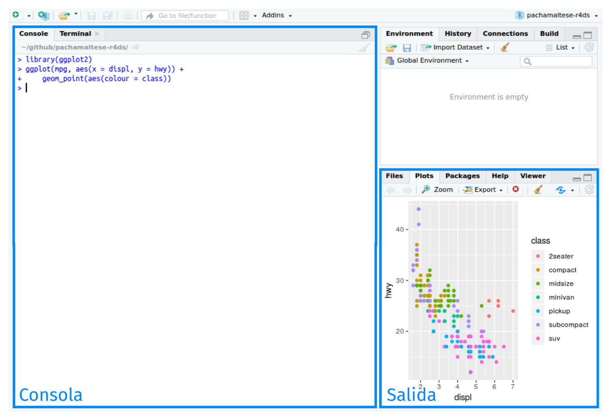
]

---
### Instalación 

.left-column[
[R](https://cran.r-project.org)

- La descarga se realiza desde CRAN según sistema operartivo.

[RStudio](https://www.rstudio.com/products/rstudio/download/)

- La descarga se realiza desde RStudio (RStudio Desktop)

.footnote[Artwork by [@allison_horst](https://twitter.com/allison_horst?lang=es)]
]

.center2[
<br>
]


---
class: inverse center middle

# Visualización con ggplot2

---
## [tidyverse](https://www.tidyverse.org)

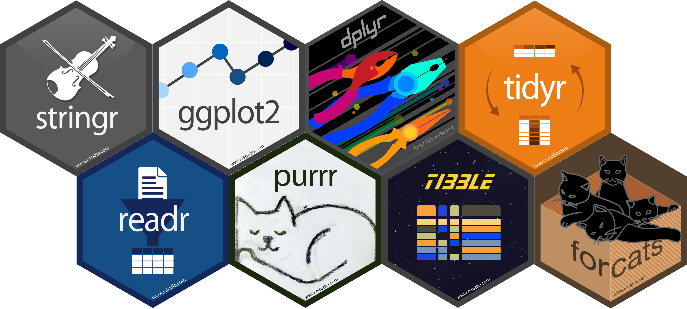<br>

---
## La filosofía detrás de [tidyverse](https://www.tidyverse.org)
.center2[
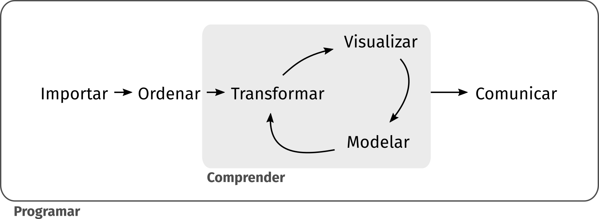<br>
]
.footnote[[R for Data Science (ES)](https://es.r4ds.hadley.nz/introducción.html)]

---
## La filosofía detrás de [ggplot2](https://ggplot2.tidyverse.org/index.html)

.center2[
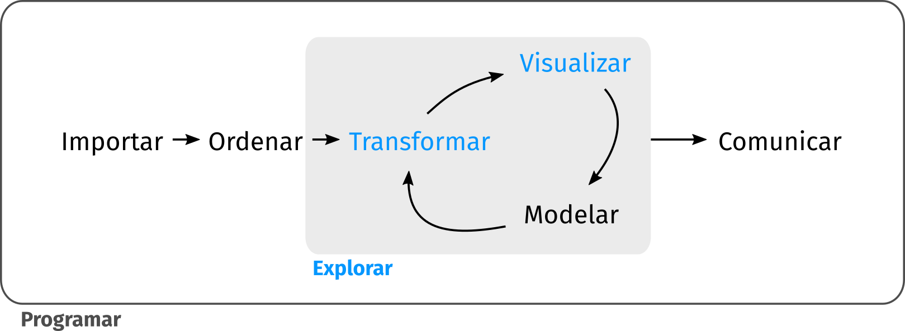<br>
]
.footnote[[R for Data Science (ES)](https://es.r4ds.hadley.nz/explorar-introduccion.html)]

---
## [ggplot2](https://ggplot2.tidyverse.org/index.html)

.left-column[
<section style="text-align: LEFT;">
<br><br>
Es un paquete de visualización escrito para el lenguaje R, creado por Hadley Wickham en 2005 y basado en Leland Wilkinson's "Grammar of Graphics". Un esquema general para la visualización de datos, que separa un gráfico en componentes semánticos como escalas y capas. <br>
</section>
]

.center2[<br>]

---
.bg-washed-green.b--dark-green.ba.bw2.br3.shadow-5.ph4.mt4[
Las diapositivas estan basadas en el aprendizaje práctico y el conocimiento libre. Para eso, todas las lineas de comando son funcionales y estan pensadas para ser facilmente copiadas y pegadas. El set de datos que se usará durante la sesión, ya se encuentra precargado junto al paquete **ggplot2**. Completando cada plot adicionalmente se ganará conocimiento básico en el lenguaje de programación R, **ggplot2**, y visualización de datos.  

.tr[
— _Consejos_
]]

--
.bg-washed-red.b--dark-red.ba.bw2.br3.shadow-5.ph4.mt4[
Es necesario para este y próximos talleres tener o instalar R, RStudio y el paquete **tidyverse** o **ggplot2**.  

.tr[
— _Advertencia_
]]

--
.bg-washed-yellow.b--gold.ba.bw2.br3.shadow-5.ph4.mt4[
This is my favorite part about analytics: Taking boring flat data and bringing it to life through visualization.  

.tr[
— _John Tukey_
]]

---
## paquete-**ggplot2**
```{r eval=FALSE, include=TRUE}
# Instalar desde CRAN (The Comprehensive R Archive Network)
install.packages("tidyverse")

# Instalar la versión beta desde GitHub
install.packages("devtools")
devtools::install_github("tidyverse/tidyverse")

# Instalar solo ggplot2
install.packages("ggplot2")
```

```{r eval=FALSE, include=TRUE}
# Cargar desde la librería
library(tidyverse)
library(ggplot2) 
```
--
.bg-washed-green.b--dark-green.ba.bw2.br3.shadow-5.ph4.mt2[
Puedes cargar **ggplot2** con **tidyverse** o independientemente en tú sesión de R. <br> Para mas información, puedes escribir `help("ggplot2")` en tú consola de R.  
.tr[
— _Consejos_
]]

---
## Los datos (ggplot2::diamonds)
```{r eval=TRUE, include=FALSE}
library(ggplot2)
```

<small> Precio de mas de 50,000 diamantes cortados. </small>

```{r}
head(diamonds)
dim(diamonds)
```

---
## Gráfico básico 
.left-code[
```{r plot-label, eval=FALSE}
ggplot(data = diamonds, 
       mapping = aes(x = price, 
                     y = carat)) + 
       geom_point()
```
> <br><small> price : Precio del diamante en US dolares ($326–$18,823)<br><br> carat : Peso del diamante (0.2–5.01) </small><br><br>
]

.right-plot[
```{r plot-label-out, ref.label="plot-label", echo=FALSE, fig.dim=c(9, 6)}
```
]

---
## Comando básico
```{r eval=FALSE, include=TRUE}
# Opción A
ggplot(data = diamonds, mapping = aes(x= price, y= carat)) + 
       geom_point()
# Opción B
ggplot(data = diamonds) + 
       geom_point(aes(x = price, y = carat))
```

* <span style="color:darkred" > `ggplot()`</span> : Es la función que crea un sistema de coordenadas -de forma general- a las que se incorporán capas. El primer argumento de la función es el set de datos (`data=`). Por si sola esta función no genera una <span style="color:#F95700FF" >capa</span><br>

--

* <span style="color:darkred" > `data` </span> : El set de datos es una colección rectangular de datos con las variables (columnas) y sus observaciones/valores (filas) a mapear (<span style="color:#00539CFF" >diamonds</span>) <br>

--

* <span style="color:darkred" > `mapping`	</span> : Es donde se especifican el conjunto de variables y observaciones que se "mapean” o asignan a las <span style="color:#F95700FF" >propiedades visuales</span> a usar en el gráfico y que ejes asignar a estos valores (<span style="color:darkred" >x=</span> <span style="color:#00539CFF" >price</span>,<span style="color:darkred" >y=</span> <span style="color:#00539CFF" >carat</span>). Si no son especificadas -de forma general-, se deben indicar en cada <span style="color:#F95700FF" >capa</span> adicionada a el gráfico.<br>

--

* <span style="color:darkred" > `geom_point()` </span> : Las capas del gráfico son incorporadas por las funciones o <span style="color:#F95700FF" >Geom</span>. En este caso la función agrega una <span style="color:#F95700FF" >capa</span> de puntos al gráfico. **ggplot2** incluye más de 30 funciones geom.<br>

.footnote[[**ggplot2** Geoms](https://ggplot2.tidyverse.org/reference/index.html)]

---
## Objetos geométricos - **ggplot2** Geom
<span style="text-align: justify;">
<br><br>

Una <span style="color:#F95700FF" >capa</span> en ggplot2, combina <span style="color:#F95700FF" >datos</span>, <span style="color:#F95700FF" >propiedades visuales</span>, <span style="color:#F95700FF" >objetos geométricos (Geoms)</span>, funciones y/o transformaciones <span style="color:#F95700FF" > estadísticas (Stat)</span>, y de ajuste de la <span style="color:#F95700FF" >posición</span>.<br><br>

Al crear una representación gráfica, la <span style="color:#F95700FF" >capa</span> a crear se definirá con el objeto <span style="color:#F95700FF" >Geom</span>. Sin embargo, la capa que podrás aplicar dependerá de tus datos. Las <span style="color:#F95700FF" >capas</span>, tambien te permitirán combinar distintos set de datos en una única representación gráfica. Esta es una de las caracteristicas que te permitirá crear gráficos sofisticados.  
</span>

--
.bg-washed-green.b--dark-green.ba.bw2.br3.shadow-5.ph4.mt5[
Puedes aplicar las capas oficiales que se encuentrán cargadas en el paquete **ggplot2** o usar funciones Geom complementarias desde otros paquetes de R.  
.tr[
— _Consejos_
]]
.footnote[[ggplot2 extensions](https://exts.ggplot2.tidyverse.org/gallery/)]

---
## **ggplot2** Propiedades Visuales  

.pull-left[
### Propiedades Visuales Requeridas
* <span style="color:#F95700FF" >X </span><br>
* <span style="color:#F95700FF" >Y </span>(Dos variables)<br>
]

.pull-right[
### Propiedades Visuales Variables
* <span style="color:#F95700FF" >Color or Colour </span><br>
* <span style="color:#F95700FF" >Fill </span><br>
* <span style="color:#F95700FF" >Size </span><br>
* <span style="color:#F95700FF" >Shape </span><br>
* <span style="color:#F95700FF" >Linetype </span><br>
* <span style="color:#F95700FF" >Alpha </span>(transparency) <br>
* <span style="color:#F95700FF" >Group </span><br>
* <span style="color:#F95700FF" >Label </span><br>
* <span style="color:#F95700FF" >Stroke </span><br>
* <span style="color:#F95700FF" >...</span><br>
]

--

.bg-washed-green.b--dark-green.ba.bw2.br3.shadow-5.ph4.mt4[
Puedes aprender más sobre estas opciones tipeando `vignette("ggplot2-specs")` en tú sesión de R.  
.tr[
— _Consejos_
]]

---
## La práctica...
.center2[<br>]
.footnote[Artwork by [@allison_horst](https://twitter.com/allison_horst?lang=es)]

---
## Volvamos al gráfico básico

.left-code[
```{r plot-label_2, eval=FALSE}
ggplot(data = diamonds, 
       mapping = aes(x = price, 
                     y = carat)) + 
       geom_point()
```
> <br><small> price : Precio del diamante en US dolares ($326–$18,823)<br><br> carat : Peso del diamante (0.2–5.01) </small><br><br>
]

.right-plot[
```{r plot-label_2-out, ref.label="plot-label_2", echo=FALSE, fig.dim=c(9, 6)}
```
]

--

<small> Mayor peso significa un mayor costo ¿Siempre? </small>

---
## ¿Qué información adicional podemos usar?

```{r echo=FALSE}
DT::datatable(head(diamonds, n=20), fillContainer = FALSE, options = list(pageLength = 4))
```

---
class: inverse center middle

## Mapeos estéticos

---
### Podemos agregar una variable distintiva al color

.left-code[
```{r plot-label_3, eval=FALSE}
ggplot(data = diamonds, 
       mapping = aes(x = price, 
                     y = carat,
                 color = color)) + 
       geom_point()
```
> <small> price : Precio del diamante en US dolares ($326–$18,823)<br><br> carat : Peso del diamante (0.2–5.01)<br><br> color : Desde D (Mejor) a J (peor)</small><br><br>

> <small> ggplot2 asigna automáticamente un nivel único de la estética (ejemplo, un color) a cada valor único de la variable. Este proceso es conocido como escalamiento ( _scaling_ ). </small><br><br>

]

.right-plot[
```{r plot-label_3-out, ref.label="plot-label_3", echo=FALSE, fig.dim=c(9, 6)}
```
]

---
### Podemos agregar también una variable fija a el color

.left-code[
```{r plot-label_3b, eval=FALSE}
ggplot(data = diamonds, 
       mapping = aes(x = price, 
                     y = carat)) + 
       geom_point(color = "darkblue")
```
> <br><small> price : Precio del diamante en US dolares ($326–$18,823)<br><br> carat : Peso del diamante (0.2–5.01)<br><br> color : Desde D (Mejor) a J (peor)</small><br><br>

]

.right-plot[
```{r plot-label_3b-out, ref.label="plot-label_3b", echo=FALSE, fig.dim=c(9, 6)}
```
]

---
### Podemos agregar una variable a la forma

.left-code[
```{r plot-label_4, eval=FALSE}
ggplot(data = diamonds, 
       mapping = aes(x = price, 
                     y = carat,
                 color = color,
                 shape = cut)) + 
       geom_point()
```
> <br><small> price : Precio del diamante en US dolares ($326–$18,823)<br><br> carat : Peso del diamante (0.2–5.01)<br><br> color : Desde D (Mejor) a J (peor)<br><br> cut : Calidad del corte </small><br><br>

]

.right-plot[
```{r plot-label_4-out, ref.label="plot-label_4", echo=FALSE, fig.dim=c(9, 6)}
```
]

--

<small> Poco a poco se hace complejo distinguir variables, probemos otra... </small>

---
### Podemos agregar una variable al el tamaño

.left-code[
```{r plot-label_5, eval=FALSE}
ggplot(data = diamonds, 
       mapping = aes(x = price, 
                     y = carat,
                 color = color,
                  size = cut)) + 
       geom_point()
```
> <br><small> price : Precio del diamante en US dolares ($326–$18,823)<br><br> carat : Peso del diamante (0.2–5.01)<br><br> color : Desde D (Mejor) a J (peor)<br><br> cut : Calidad del corte </small><br><br>

]

.right-plot[
```{r plot-label_5-out, ref.label="plot-label_5", echo=FALSE, fig.dim=c(9, 6)}
```
]

--

<small> ¿Qué podemos hacer?</small>

---
### No saturar con información

<medium> Dependiendo del set de datos se pueden incorporar de 3 a 4 variables. Un mayor número de variables es complejo de visualizar y es recomendable usar otras aproximaciones. Aplicar el principio minimalista. </medium> 

<center><figure><figcaption>Farnsworth House (1951), Illinois, USA.</figcaption></figure></center>

.bg-washed-yellow.b--gold.ba.bw2.br3.shadow-5.ph4.mt2[
Less is more!  

.tr[
— _Ludwig Mies Van Der Rohe_
]]

---
class: inverse center middle

## Gráficos en capas

---
### ¿Podriamos usar otros objetos geométricos?
.pull-left[
### Una variable
* geom_bar() <br>
* geom_histogram() <br>
* geom_density() <br> 
* geom_area() <br> 
* geom_dotplot() <br>
* geom_freqpoly() <br>
* geom_histogram() <br>
* geom_qq() <br>

### Tres variables
* geom_contour() <br>
* geom_tile() <br>
* geom_raster() <br>
]

.pull-right[
### Dos variables
* geom_point() <br>
* geom_jitter() <br>
* geom_col() <br>
* geom_line() <br>
* geom_smooth() <br>
* geom_quantile()<br>
* geo_boxplot()<br>
* ... <br>

### Visualizando el Error
* geom_crossbar() <br>
* geom_errorbar() <br>
* geom_linerange() <br>
* geom_pointrange() <br>
]

---
### Agregar un objeto Geom o capa
.left-code[
```{r plot-label_7, eval=FALSE}
ggplot(data = diamonds, 
       mapping = aes(x = price, 
                     y = carat,
                 color = color)) + 
       geom_point() +
       geom_smooth()
```
> <br><small> price : Precio del diamante en US dolares ($326–$18,823)<br><br> carat : Peso del diamante (0.2–5.01)<br><br> color : Desde D (Mejor) a J (peor)</small><br><br>

]

.right-plot[
```{r plot-label_7-out, ref.label="plot-label_7", echo=FALSE, fig.dim=c(9, 6)}
```
]

---
### Agregar un objeto Geom o capa
.left-code[
```{r plot-label_7b, eval=FALSE}
ggplot(data = diamonds,
       mapping = aes(x = price, 
                     y = carat,
                 color = color)) + 
       geom_point() +
       geom_smooth(color = "black")
```
> <br><small> price : Precio del diamante en US dolares ($326–$18,823)<br><br> carat : Peso del diamante (0.2–5.01)<br><br> color : Desde D (Mejor) a J (peor)</small><br><br>

]

.right-plot[
```{r plot-label_7b-out, ref.label="plot-label_7b", echo=FALSE, fig.dim=c(9, 6)}
```
]

---
### Agregar un objeto Geom o capa a un grupo en particular 
.left-code[
```{r plot-label_7c, eval=FALSE}
ggplot(data = filter(diamonds, cut == "Premium"),
       mapping = aes(x = price, 
                     y = carat,
                 color = color)) + 
       geom_point() +
       geom_smooth()
```
> <br><small> price : Precio del diamante en US dolares ($326–$18,823)<br><br> carat : Peso del diamante (0.2–5.01)<br><br> color : Desde D (Mejor) a J (peor)<br><br> cut : Calidad del corte</small><br><br>

]

.right-plot[
```{r plot-label_7c-out, ref.label="plot-label_7c", echo=FALSE, fig.dim=c(9, 6)}
```
]

---
### Agregar un objeto Geom o capa a un grupo en particular 
.left-code[
```{r plot-label_7d, eval=FALSE, warning=FALSE}
ggplot(data = filter(diamonds, 
                     cut == "Premium" & 
                 clarity == "IF"),
       mapping = aes(x = price, 
                     y = carat,
                 color = color)) + 
       geom_point() +
       geom_smooth()
```
> <br><small> price : Precio del diamante en US dolares ($326–$18,823)<br><br> carat : Peso del diamante (0.2–5.01)<br><br> color : Desde D (Mejor) a J (peor)<br><br> cut : Calidad del corte<br><br> clarity : Claridad I1 (peor), SI2, SI1, VS2, VS1, VVS2, VVS1, IF (Mejor)</small><br><br>

]

.right-plot[
```{r plot-label_7d-out, ref.label="plot-label_7d", echo=FALSE, fig.dim=c(9, 6)}
```
]

---
### Agregar un objeto Geom o capa a un grupo en particular 
.left-code[
```{r plot-label_7e, eval=FALSE, warning=FALSE}
ggplot(data = diamonds,
       mapping = aes(x = price, 
                     y = carat,
                 color = color)) + 
       geom_point() +
       geom_smooth(data = filter(diamonds, color == "D"))
```
> <br><small> price : Precio del diamante en US dolares ($326–$18,823)<br><br> carat : Peso del diamante (0.2–5.01)<br><br> color : Desde D (Mejor) a J (peor)<br><br> cut : Calidad del corte</small><br><br>

]

.right-plot[
```{r plot-label_7e-out, ref.label="plot-label_7e", echo=FALSE, fig.dim=c(9, 6)}
```
]

---
### ¿Qué historia nos interesa contar?
.pull-left[
- ¿Hay homogeneidad entre grupos?<br><br>
- ¿Hay grupos que difieren de la tendencia general?<br><br> 
- ¿Hay datos que difieren de la mayoría (outliers)?<br><br>
- ¿Hay algún cambio drástico?<br><br>
- ¿Hay alguna tendencia en el tiempo o variable de interés?<br><br>
- ¿Hay datos que se comportan contrarío a lo descrito?<br><br>
- ¿Que mensaje quiero transmitir?<br><br>
- ... <br>
]

<center>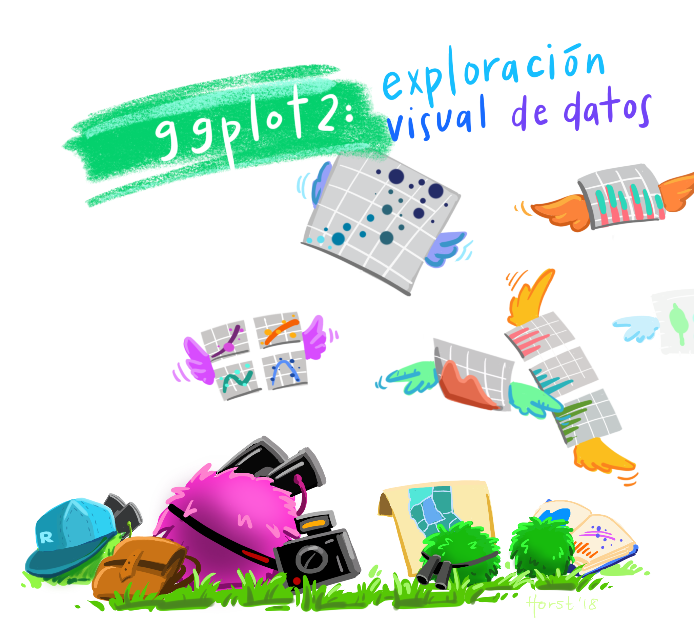</center>

.footnote[Artwork by [@allison_horst](https://twitter.com/allison_horst?lang=es)]

---
### Revisemos la información
.left-code[
```{r plot-label_8, eval=FALSE}
ggplot(data = diamonds, 
       mapping = aes(x = price, 
                     y = carat,
                 color = color)) + 
       geom_point()
```
> <br><small> price : Precio del diamante en US dolares ($326–$18,823)<br><br> carat : Peso del diamante (0.2–5.01)<br><br> color : Desde D (Mejor) a J (peor)</small><br><br>

]

.right-plot[
```{r plot-label_8-out, ref.label="plot-label_8", echo=FALSE, fig.dim=c(9, 6)}
```
]

---
### Revisemos el tamaño de los grupos
.left-code[
```{r plot-label_9, eval=FALSE}
ggplot(data = diamonds, 
       mapping = aes(x = color,
                 color = color)) + 
       geom_bar()
```
> <br><small> color : Desde D (Mejor) a J (peor)<br><br> cut : Calidad del corte</small></small><br><br>
]
.right-plot[
```{r plot-label_9-out, ref.label="plot-label_9", echo=FALSE, fig.dim=c(9, 6)}
```
]
--
<small> ¿Qué ocurre si ocupamos `fill` y no `color`?</small>

---
### Revisemos el tamaño de los grupos
.left-code[
```{r plot-label_9b, eval=FALSE}
ggplot(data = diamonds, 
       mapping = aes(x = color,
                 fill = color)) + 
       geom_bar()
```
> <br><small> color : Desde D (Mejor) a J (peor)<br><br> cut : Calidad del corte</small></small><br><br>

]

.right-plot[
```{r plot-label_9b-out, ref.label="plot-label_9b", echo=FALSE, fig.dim=c(9, 6)}
```
]
<small> ¿Qué ocurre si ocupamos `fill` y no `color`?</small>

---
class: inverse center middle

## Transformación estadística

---
### Transformación estadística

Algunos objetos Geom, intrínsicamente generan transformaciones estadísticas a los datos para poder gráficar su geometría. Algunos ejemplos corresponden a:

--

* Gráficos de barras `geom_bar()`, histogramas `geom_histogram()` y polígonos de frecuencia `geom_polygon()` los que almacenan los datos y luego grafican las cuentas ( _count_) por contenedores ( _bins_). <br><br>

--
* Gráficos de líneas suavizadas ( _smoothers_) `geom_smooth()`el que ajusta un modelo a los datos y luego grafica las predicciones del modelo. <br><br>

--
* Diagramas de caja `geom_boxplot()` el que calcula un resumen robusto de la distribución (Q1,Q2,Q3,Q4) y luego muestra su formato especial. <br><br>

--
Todas estas tranformaciones son realizadas por elementos llamados _stat_ ( _**stat**istical transformation_). En el caso de las cuentas el elemento se llama `stat_count()`

---
### Revisemos el tamaño de los grupos
.left-code[
```{r plot-label_9c, eval=FALSE}
ggplot(data = diamonds, 
       mapping = aes(x = color,
                 fill = color)) + 
       stat_count()
```
> <br><small> color : Desde D (Mejor) a J (peor)</small></small><br><br>

]

.right-plot[
```{r plot-label_9c-out, ref.label="plot-label_9c", echo=FALSE, fig.dim=c(9, 6)}
```
]

---
### Revisemos el tamaño de los grupos
.left-code[
```{r plot-label_9d, eval=FALSE}
ggplot(data = diamonds, 
       mapping = aes(x = cut,
                 fill = color)) + 
       geom_bar()
```
> <br><small> color : Desde D (Mejor) a J (peor)<br><br> cut : Calidad del corte</small></small><br><br>

]

.right-plot[
```{r plot-label_9d-out, ref.label="plot-label_9d", echo=FALSE, fig.dim=c(9, 6)}
```
]

---
### Revisemos la cantidad por grupos ajustando la posición 
.left-code[
```{r plot-label_9e, eval=FALSE}
  ggplot(data = diamonds,
         aes(x=cut,
          fill=color)) +
  geom_bar(position = "dodge")
```

> <br><small> color : Desde D (Mejor) a J (peor) <br><br> cut : Calidad del corte</small><br><br>

]

.right-plot[
```{r plot-label_9e-out, ref.label="plot-label_9e", echo=FALSE, fig.dim=c(9, 6)}
```
]

---
### Revisemos la cantidad por grupos ajustando la posición 
.left-code[
```{r plot-label_9f, eval=FALSE}
  ggplot(data = diamonds,
         aes(x=cut,
          fill=color)) +
  geom_bar(position = "fill")
```

> <br><small> color : Desde D (Mejor) a J (peor) <br><br> cut : Calidad del corte</small><br><br>

]

.right-plot[
```{r plot-label_9f-out, ref.label="plot-label_9f", echo=FALSE, fig.dim=c(9, 6)}
```
]

---
### Revisemos el tamaño de los grupos
.left-code[
```{r plot-label_9g, eval=FALSE}
ggplot(data = diamonds, 
       mapping = aes(x = clarity,
                 fill = color)) + 
       geom_bar()
```
> <br><small> clarity : Claridad I1 (peor), SI2, SI1, VS2, VS1, VVS2, VVS1, IF (Mejor)</small><br><br>

]

.right-plot[
```{r plot-label_9g-out, ref.label="plot-label_9g", echo=FALSE, fig.dim=c(9, 6)}
```
]

---
### Revisemos la tendencia general de los datos
.left-code[
```{r plot-label_10, eval=FALSE}
ggplot(data = diamonds, 
       mapping = aes(x = price, 
                     y = carat,
                 color = color)) + 
       geom_smooth()
```
> <br><small> price : Precio del diamante en US dolares ($326–$18,823)<br><br> carat : Peso del diamante (0.2–5.01)<br><br> color : Desde D (Mejor) a J (peor)</small><br><br>

]

.right-plot[
```{r plot-label_10-out, ref.label="plot-label_10", echo=FALSE, fig.dim=c(9, 6)}
```
]

---
### Revisemos la tendencia general de los datos
.left-code[
```{r plot-label_10b, eval=FALSE}
ggplot(data = diamonds, 
       mapping = aes(x = price, 
                     y = carat,
                 color = clarity)) + 
       geom_smooth()
```
> <br><small> price : Precio del diamante en US dolares ($326–$18,823)<br><br> carat : Peso del diamante (0.2–5.01)<br><br> clarity : Claridad I1 (peor), SI2, SI1, VS2, VS1, VVS2, VVS1, IF (Mejor)</small><br><br>

]

.right-plot[
```{r plot-label_10b-out, ref.label="plot-label_10b", echo=FALSE, fig.dim=c(9, 6)}
```
]

---
### Revisemos la distribución por grupos 
.left-code[
```{r plot-label_11, eval=FALSE}
  ggplot(data = diamonds,
         aes(x=color,
             y=price, 
         color=color)) +
  geom_boxplot()
```

> <br><small> price : Precio del diamante en US dolares ($326–$18,823)<br><br> color : Desde D (Mejor) a J (peor)</small><br><br>

]

.right-plot[
```{r plot-label_11-out, ref.label="plot-label_11", echo=FALSE, fig.dim=c(9, 6)}
```
]
---
### Revisemos la distribución por grupos 
.left-code[
```{r plot-label_11b, eval=FALSE}
  ggplot(data = diamonds,
         aes(x=cut,
             y=price, 
         color=cut)) +
  geom_boxplot()
```

> <br><small> price : Precio del diamante en US dolares ($326–$18,823)<br><br> cut : Calidad del corte</small><br><br>

]

.right-plot[
```{r plot-label_11b-out, ref.label="plot-label_11b", echo=FALSE, fig.dim=c(9, 6)}
```
]

---
### Revisemos la distribución por grupos combinados 
.left-code[
```{r plot-label_11c, eval=FALSE}
  ggplot(data = diamonds,
         aes(x=cut,
             y=price, 
         color=color)) +
  geom_boxplot()
```

> <br><small> price : Precio del diamante en US dolares ($326–$18,823)<br><br> cut : Calidad del corte</small><br><br>

]

.right-plot[
```{r plot-label_11c-out, ref.label="plot-label_11c", echo=FALSE, fig.dim=c(9, 6)}
```
]

---
### Revisemos la distribución por grupos combinados 
.left-code[
```{r plot-label_11d, eval=FALSE}
  ggplot(data = diamonds,
         aes(x=cut,
             y=price, 
          fill=color)) + 
  geom_boxplot(outlier.colour = NA) # Elimina los outliers
```

> <br><small> price : Precio del diamante en US dolares ($326–$18,823)<br><br> cut : Calidad del corte</small><br><br>

]

.right-plot[
```{r plot-label_11d-out, ref.label="plot-label_11d", echo=FALSE, fig.dim=c(9, 6)}
```
]

---
### Revisemos la distribución por grupos
.left-code[
```{r plot-label_11e, eval=FALSE}
ggplot(data = diamonds,
    mapping = aes(x = cut, 
                  y = carat)) + 
  stat_summary(fun.min = min,
               fun.max = max,
                   fun = median)
```
> <br><small> price : Precio del diamante en US dolares ($326–$18,823)<br><br> carat : Peso del diamante (0.2–5.01)</small><br><br>

]

.right-plot[
```{r plot-label_11e-out, ref.label="plot-label_11e", echo=FALSE, fig.dim=c(9, 6)}
```
]

---
### Revisemos la distribución por grupos
.left-code[
```{r plot-label_11g, eval=FALSE}
ggplot(data = diamonds,
    mapping = aes(x = cut, 
                  y = carat,
              color = color)) + 
  stat_summary(fun.min = min,
               fun.max = max,
                   fun = median,
              position = position_dodge(width = 0.7)) 
```
> <br><small> price : Precio del diamante en US dolares ($326–$18,823)<br><br> carat : Peso del diamante (0.2–5.01)<br><br> color : Desde D (Mejor) a J (peor)</small><br><br>

]

.right-plot[
```{r plot-label_11g-out, ref.label="plot-label_11g", echo=FALSE, fig.dim=c(9, 6)}
```
]

---
class: inverse center middle

## Otros Ajustes
### Estrategias para visualizar datos agrupados

---
### Revisemos la tendencia general por grupos 
.left-code[
```{r plot-label_12, eval=FALSE}
ggplot(data = diamonds, 
       mapping = aes(x = price, 
                     y = carat,
                 color = color)) + 
       geom_smooth() +
       facet_wrap(vars(cut))
```
> <br><small> price : Precio del diamante en US dolares ($326–$18,823)<br><br> carat : Peso del diamante (0.2–5.01)<br><br> color : Desde D (Mejor) a J (peor)<br><br> cut : Calidad del corte</small><br><br>

]

.right-plot[
```{r plot-label_12-out, ref.label="plot-label_12", echo=FALSE, fig.dim=c(9, 6)}
```
]

---
### Revisemos la tendencia general por grupos 
.left-code[
```{r plot-label_12b, eval=FALSE, warning=FALSE}
ggplot(data = diamonds, 
       mapping = aes(x = price, 
                     y = carat,
                 color = color)) + 
       geom_smooth() +
       facet_grid(clarity~cut)
```
> <br><small> price : Precio del diamante en US dolares ($326–$18,823)<br><br> carat : Peso del diamante (0.2–5.01)<br><br> color : Desde D (Mejor) a J (peor)<br><br> cut : Calidad del corte <br><br> clarity : Claridad I1 (peor), SI2, SI1, VS2, VS1, VVS2, VVS1, IF (Mejor)</small><br><br>

]

.right-plot[
```{r plot-label_12b-out, ref.label="plot-label_12b", echo=FALSE, fig.dim=c(9, 6)}
```
]

<small> ¿Qué determina el precio?</small>

---
### Revisemos la tendencia general por grupos 
.left-code[
```{r plot-label_12c, eval=FALSE, warning=FALSE}
ggplot(data = diamonds, 
       mapping = aes(x = price, 
                     y = carat,
                 color = color)) + 
       geom_smooth() +
       facet_grid(cut~clarity)
```
> <br><small> price : Precio del diamante en US dolares ($326–$18,823)<br><br> carat : Peso del diamante (0.2–5.01)<br><br> color : Desde D (Mejor) a J (peor)<br><br> cut : Calidad del corte <br><br> clarity : Claridad I1 (peor), SI2, SI1, VS2, VS1, VVS2, VVS1, IF (Mejor)</small><br><br>

]

.right-plot[
```{r plot-label_12c-out, ref.label="plot-label_12c", echo=FALSE, fig.dim=c(9, 6)}
```
]

<small> ¿Qué determina el precio?</small>

---
### Revisemos la tendencia general por grupos 
.left-code[
```{r plot-label_12d, eval=FALSE, warning=FALSE}
ggplot(data = diamonds, 
       mapping = aes(x = price, 
                     y = carat,
                 color = color)) + 
       geom_smooth() +
       facet_grid(.~cut)
```
> <br><small> price : Precio del diamante en US dolares ($326–$18,823)<br><br> carat : Peso del diamante (0.2–5.01)<br><br> color : Desde D (Mejor) a J (peor)<br><br> cut : Calidad del corte <br><br> clarity : Claridad I1 (peor), SI2, SI1, VS2, VS1, VVS2, VVS1, IF (Mejor)</small><br><br>

]

.right-plot[
```{r plot-label_12d-out, ref.label="plot-label_12d", echo=FALSE, fig.dim=c(9, 6)}
```
]

<small> ¿Qué determina el precio?</small>

---
### Revisemos la tendencia general por grupos 
.left-code[
```{r plot-label_12e, eval=FALSE, warning=FALSE}
ggplot(data = diamonds, 
       mapping = aes(x = price, 
                     y = carat,
                 color = color)) + 
       geom_smooth() +
       facet_grid(cut~.)
```
> <br><small> price : Precio del diamante en US dolares ($326–$18,823)<br><br> carat : Peso del diamante (0.2–5.01)<br><br> color : Desde D (Mejor) a J (peor)<br><br> cut : Calidad del corte <br><br> clarity : Claridad I1 (peor), SI2, SI1, VS2, VS1, VVS2, VVS1, IF (Mejor)</small><br><br>

]

.right-plot[
```{r plot-label_12e-out, ref.label="plot-label_12e", echo=FALSE, fig.dim=c(9, 6)}
```
]

<small> ¿Qué determina el precio?</small>

---
class: inverse center middle

## Otros Ajustes
### Estrategias para ordenar datos

---
### Ordenar columnas por cuentas ascendentes
.left-code[
```{r plot-label_13, eval=FALSE}
ggplot(data = diamonds %>% group_by(color) %>% slice_max(price, n=1),  
       mapping = aes(x = price,
                     y = color,
                 color = color)) + 
  geom_point(size = 4)
```

> <small>`group_by` {dplyr} permite agrupar por una o más variables un set de datos. En el ejemplo <span style="color:#00539CFF" >color</span>.</small><br><br>
> <small>`slice_max` {dplyr} permite extraer n valores máximos. En el ejemplo extraerá el valor máximo de <span style="color:#00539CFF" >price</span> según cada grupo <span style="color:#00539CFF" >color</span>.</small><br>

.footnote[[group_by](https://dplyr.tidyverse.org/reference/group_by.html), [slice_max](https://dplyr.tidyverse.org/reference/slice.html) {dplyr}]
]

.right-plot[
```{r plot-label_13-out, ref.label="plot-label_13", echo=FALSE, fig.dim=c(9, 6)}
```
]

---
### _Pipe_

La _Pipe_ (tubería), `%>%`, proviene del paquete **magrittr** de Stefan Milton Bache. Los paquetes en tidyverse cargan `%>%` automáticamente, por lo que normalmente no carga **magrittr** explícitamente. Las _Pipes_ son una herramienta poderosa para expresar claramente una secuencia de múltiples operaciones. <br>

#### Sin _Pipes_
```{r eval=FALSE}
slice_max(group_by(diamonds, color), price, n=1)  
```
> Es necesario leer la expresión de adentro hacia afuera

#### Con _Pipes_
```{r eval=FALSE}
diamonds %>%              # 1) Mis datos de entrada
  group_by(color) %>%     # 2) Agrupar por el color del diamante
  slice_max(price, n=1)   # 3) Seleccionar el precio máximo (nº1) para cada grupo
```
> Podemos leer la expresión de forma secuencial

.footnote[[Pipes](https://es.r4ds.hadley.nz/pipes.html?q=pipes#pipes)]

---
### Ordenar columnas por cuentas ascendentes
.left-code[
```{r plot-label_13b, eval=FALSE}
ggplot(data = diamonds %>% group_by(color) %>% slice_max(price, n=1),  
       mapping = aes(x = price,
                     y = fct_reorder(color, price),
                 color = fct_reorder(color, price, .desc = TRUE))) + 
  geom_point(size = 4)
```

> <small>`group_by` {dplyr} permite agrupar por una o más variables un set de datos. En el ejemplo <span style="color:#00539CFF" >color</span>.</small><br><br>
> <small>`slice_max` {dplyr} permite extraer n valores máximos. En el ejemplo extraerá el valor máximo de <span style="color:#00539CFF" >price</span> según cada grupo <span style="color:#00539CFF" >color</span>.</small><br>

.footnote[[group_by](https://dplyr.tidyverse.org/reference/group_by.html), [slice_max](https://dplyr.tidyverse.org/reference/slice.html) {dplyr}]
]

.right-plot[
```{r plot-label_13b-out, ref.label="plot-label_13b", echo=FALSE, fig.dim=c(9, 6)}
```
]

---
### Ordenar columnas por cuentas ascendentes (Problema)
.left-code[
```{r plot-label_13c, eval=FALSE}
ggplot(data = diamonds %>% group_by(clarity) %>% slice_max(price, n=1),  
       mapping = aes(x = price,
                     y = fct_reorder(clarity, price),
                 color = clarity)) + 
  geom_point(size = 4)
```

> <small>`group_by` {dplyr} permite agrupar por una o más variables un set de datos. En el ejemplo <span style="color:#00539CFF" >color</span>.</small><br><br>
> <small>`slice_max` {dplyr} permite extraer n valores máximos. En el ejemplo extraerá el valor máximo de <span style="color:#00539CFF" >price</span> según cada grupo <span style="color:#00539CFF" >color</span>.</small><br> 

.footnote[[group_by](https://dplyr.tidyverse.org/reference/group_by.html), [slice_max](https://dplyr.tidyverse.org/reference/slice.html) {dplyr}]
]

.right-plot[
```{r plot-label_13c-out, ref.label="plot-label_13c", echo=FALSE, fig.dim=c(9, 6)}
```
> La leyenda esta desordenada

]

---
### Ordenar variables por valor máximo 
```{r plot-label_13d, eval=FALSE}
ggplot(data = diamonds, 
       mapping = aes(x = price, 
                     y = carat,
                 color = clarity)) + 
       geom_smooth()

# Variables ordenadas por su cordenada valor de y en x máximo
ggplot(data = diamonds, 
       mapping = aes(x = price, 
                     y = carat,
                 color = forcats::fct_reorder2(clarity, price, carat))) + 
       geom_smooth() + labs(color="clarity")
```

.center[
```{r plot-label_13d-out, ref.label="plot-label_13d", fig.show="hold", echo=FALSE, fig.dim=c(4.5, 3)}
```
]

---
### Ordenar columnas por cuentas ascendentes
.left-code[
```{r plot-label_13e, eval=FALSE}
ggplot(data = diamonds %>% 
       mutate(color = color %>% fct_infreq() %>% fct_rev()), 
       mapping = aes(x = color,
                 fill = color)) + 
       geom_bar()
```
> <br><small> color : Desde D (Mejor) a J (peor)</small><br><br>

> `mutate` {dplyr} permite modificar o crear nuevas columnas dentro de un set de datos. 

.footnote[[mutate](https://dplyr.tidyverse.org/reference/mutate.html) {dplyr}]
]

.right-plot[
```{r plot-label_13e-out, ref.label="plot-label_13e", echo=FALSE, fig.dim=c(9, 6)}
```
]

---
### Ordenar variables manualmente
.left-code[
```{r plot-label_13f, eval=FALSE}
ggplot(data = diamonds, 
       mapping = aes(x = price, 
                     y = carat,
                 color = forcats::fct_relevel(clarity, "I1", "VS2", "SI2", "SI1", "VS1", "VVS2", "VVS1", "IF"))) + 
       geom_smooth() +
       labs(color = "clarity")
```
> <br><small> price : Precio del diamante en US dolares ($326–$18,823)<br><br> carat : Peso del diamante (0.2–5.01)<br><br> clarity : Claridad I1 (peor), SI2, SI1, VS2, VS1, VVS2, VVS1, IF (Mejor)</small><br><br>

]

.right-plot[
```{r plot-label_13f-out, ref.label="plot-label_13f", echo=FALSE, fig.dim=c(9, 6)}
```
]

---
class: inverse center middle

## Otros Ajustes
### Modificar la estética del gráfico para elementos que no son datos 

---
### Temas incluidos en ggplot2
```{r plot-label_14, echo=FALSE, message=FALSE, warning=FALSE, fig.dim=c(16, 7)}
# Crear el gráfico
plot <- 
ggplot(data = diamonds, 
       mapping = aes(x = price, 
                     y = carat,
                 color = color)) + 
       geom_smooth()

# With themes
plot1 = plot + theme_gray() + annotate("text", x = 5000, y = 4, label = "theme_gray()" , col="#73455E" , size=4)
plot2 = plot + theme_bw() + annotate("text", x = 5000, y = 4, label = "theme_bw()" , col="#73455E" , size=4)
plot3 = plot + theme_linedraw() + annotate("text", x = 5000, y = 4, label = "theme_linedraw()" , col="#73455E" , size=4)
plot4 = plot + theme_light() + annotate("text", x = 5000, y = 4, label = "theme_light()" , col="#73455E" , size=4)
plot5 = plot + theme_dark() + annotate("text", x = 5000, y = 4, label = "theme_dark()" , col="#D7D7D9" , size=4)
plot6 = plot + theme_minimal() + annotate("text", x = 5000, y = 4, label = "theme_minimal()" , col="#73455E" , size=4)
plot7 = plot + theme_classic() + annotate("text", x = 5000, y = 4, label = "theme_classic()" , col="#73455E" , size=4)
plot8 = plot + theme_void() + annotate("text", x = 5000, y = 4, label = "theme_void()" , col="#73455E" , size=4)
 
 
# Arreglar y generar gráficos en cuadrícula 2x1 
grid.arrange(plot1,plot2,plot3,plot4,plot5,plot6,plot7,plot8, ncol=4)
```

.footnote[[Temas](https://ggplot2.tidyverse.org/reference/ggtheme.html) {ggplot2}]

---
### Temas en ggplot2

Un tema en **ggplot2** corresponde a un conjunto de parámetros estéticos que son accesorios a los datos representados en el gráfico. Estos parámetros corresponden a el texto de los ejes, líneas, color de fondo entre muchos otros parámetros, que con práctica se harán muy fáciles de manipular. Para seleccionar un tema en ggplot debes agregarlo como si fuera una capa adicional.<br>

```{r eval=FALSE, include=TRUE}
ggplot(data = diamonds, mapping = aes(x = price, y = carat, color = color)) + 
       geom_smooth() + 
       theme_gray() # Tema por defecto en ggplot2. El resultado de este comando es 
                    # el mismo que al no llamar theme_gray()

ggplot(data = diamonds, mapping = aes(x = price, y = carat, color = color)) + 
       geom_smooth() + 
       theme_classic() # Tema clásico minimalista

## Modificar un tema manualmente
ggplot(data = diamonds, mapping = aes(x = price, y = carat, color = color)) + 
       geom_smooth() + 
       theme(axis.text = element_text(size = 8)) # Modificar solo el tamaño del texto en los ejes 
                                                 # con theme_gray() por defecto. Tambien podrías  
                                                 # colocarlo posterior a theme_classic(), para  
                                                 # modificar el elementos sobre ese tema.
```

.footnote[[Modificar elementos de un tema manualmente](https://ggplot2.tidyverse.org/reference/theme.html) {ggplot2}]

---
### Leyendas en ggplot2

Adicionalmente en **ggplot2** podemos modificar los títulos de los ejes (x,y), título principal, o subtítulos fácilmente con la función `labs()`.  

.left-code[
```{r plot-label_14b, eval=FALSE, include=TRUE, message=FALSE, warning=FALSE}
# Para seleccionar un tema en ggplot 
# debes agregarlo como si fuera una 
# capa adicional
ggplot(data = diamonds, 
    mapping = aes(x = price, 
                  y = carat, 
              color = color)) + 
       geom_smooth() +
       theme_classic() + # Tema clásico minimalista
       labs(title = "Diamantes",
         subtitle = "Datos de sobre 50.000 diamantes cortados",
                x = "Precio (USD)",
                y = "Peso del Diamante",
           colour = "Color")
```

.footnote[[Modificar leyendas](https://ggplot2.tidyverse.org/reference/labs.html) {ggplot2}]
]

.right-plot[
```{r plot-label_14b-out, ref.label="plot-label_14b", echo=FALSE, fig.dim=c(9, 6)}
```
]

---
class: inverse center middle

## Otros Ajustes
### Modificar Escalas

---
### Escala Logarítmica
.left-code[
```{r plot-label_15, eval=FALSE}
ggplot(data = diamonds, 
       mapping = aes(x = price, 
                     y = carat,
                 color = color)) + 
       geom_smooth() +
       scale_y_log10() +
       scale_x_log10()
```
> <br><small> price : Precio del diamante en US dolares ($326–$18,823)<br><br> carat : Peso del diamante (0.2–5.01)<br><br> color : Desde D (Mejor) a J (peor)</small><br><br>

Escala no lineal apropiada cuando los datos muestran una gran dispersión. <br>
]

.right-plot[
```{r plot-label_15-out, ref.label="plot-label_15", echo=FALSE, fig.dim=c(9, 6)}
```
]

---
### Escala Cuadratíca
.left-code[
```{r plot-label_15b, eval=FALSE}
ggplot(data = diamonds, 
       mapping = aes(x = price, 
                     y = carat,
                 color = color)) + 
       geom_smooth() +
       scale_y_sqrt() +
       scale_x_sqrt()
```
> <br><small> price : Precio del diamante en US dolares ($326–$18,823)<br><br> carat : Peso del diamante (0.2–5.01)<br><br> color : Desde D (Mejor) a J (peor)</small><br><br>

Apropiada para datos expresados de forma cuadrática, por ejemplo m2, km2.<br>
]

.right-plot[
```{r plot-label_15b-out, ref.label="plot-label_15b", echo=FALSE, fig.dim=c(9, 6)}
```
]

---
### Escala Invertida 
.left-code[
```{r plot-label_15c, eval=FALSE}
ggplot(data = diamonds, 
       mapping = aes(x = price, 
                     y = carat,
                 color = color)) + 
       geom_smooth() +
       scale_y_reverse() +
       scale_x_reverse()
```
> <br><small> color : Desde D (Mejor) a J (peor) <br><br> cut : Calidad del corte</small><br><br>
]

.right-plot[
```{r plot-label_15c-out, ref.label="plot-label_15c", echo=FALSE, fig.dim=c(9, 6)}
```
]

---
## paquete-**scales**
```{r eval=FALSE, include=TRUE}
# Instalar desde CRAN (The Comprehensive R Archive Network)
install.packages("scales")

```

```{r eval=FALSE, include=TRUE}
# Cargar desde la librería
library(scales)
```

.bg-washed-green.b--dark-green.ba.bw2.br3.shadow-5.ph4.mt2[
Para mas información, puedes escribir `help("scales")` en tú consola de R.  
.tr[
— _Consejos_
]]

---
### Modificar escalas 
.left-code[
```{r plot-label_15d, eval=FALSE}
ggplot(data = diamonds, 
       mapping = aes(x = price, 
                     y = carat,
                 color = color)) +
  geom_smooth() +
  scale_x_continuous(labels = scales::dollar)
```
> <br><small> color : Desde D (Mejor) a J (peor) <br><br> cut : Calidad del corte</small><br><br>
]

.right-plot[
```{r plot-label_15d-out, ref.label="plot-label_15d", echo=FALSE, fig.dim=c(9, 6)}
```
]

---
### Modificar escalas
.left-code[
```{r plot-label_15e, eval=FALSE}
  ggplot(data = diamonds,
         aes(x=cut,
          fill=color)) +
  geom_bar(position = "fill") +
  scale_y_continuous(labels = scales::percent)
```

> <br><small> color : Desde D (Mejor) a J (peor) <br><br> cut : Calidad del corte</small><br><br>

]

.right-plot[
```{r plot-label_15e-out, ref.label="plot-label_15e", echo=FALSE, fig.dim=c(9, 6)}
```
]

---
class: inverse center middle

## Otros Ajustes
### Guardar un gráfico

---
### Guardar un gráfico creado en **ggplot2**
```{r plot-label_16, eval=FALSE, include=TRUE}
# Opción 1
ggplot(data = diamonds, mapping = aes(x = price, y = carat, color = color)) + geom_point()

## Guardarlo 
ggsave("nombre.pdf")

## Guardarlo con especificaciones
ggsave("nombre.pdf", width = 20, height = 20, units = "cm")
ggsave("nombre.png", width = 20, height = 20, units = "cm")
ggsave("nombre.tiff", width = 20, height = 20, units = "cm")

# Opción 2
pdf("nombre.pdf")
ggplot(data = diamonds, mapping = aes(x = price, y = carat, color = color)) + geom_point()
dev.off()

png("nombre.png")
ggplot(data = diamonds, mapping = aes(x = price, y = carat, color = color)) + geom_point()
dev.off()
```
><small>
Dispositivos: "eps", "ps", "tex", "pdf", "jpeg", "tiff", "png", "bmp", "svg"<br>
units (unidades): "in", "cm", "mm"<br>
dpi (resolución del gráfico): "retina" (320), "print" (300), or "screen" (72)</small>

---
class: inverse center middle

# Consideraciones generales
## Posición y Color

---
### Regla de la tinta proporcional (*principle of proportional ink*)

.center[
```{r echo=FALSE, fig.dim=c(4.5, 4.5)}
ggplot(data = diamonds %>% 
       mutate(color = color %>% fct_infreq() %>% fct_rev()), 
       mapping = aes(x = color,
                 fill = color)) + 
       geom_bar() +
  scale_y_continuous(breaks = c(3000, seq(3000, 11000, 2000))) +
  coord_cartesian(ylim = c(3000, 11000))
```
]

.bg-washed-red.b--dark-red.ba.bw2.br3.shadow-5.ph3.mt3[
Los gráficos de barras y áreas en una escala lineal siempre deben comenzar en 0. <br>  
.tr[
— _Advertencia_
]]

.footnote[[Fundamentals of Data Visualization - Claus Wilke - (Chapter 17) The principle of proportional ink](https://clauswilke.com/dataviz/proportional-ink.html)]

---
## Escalas de color 

.pull-left[
.center[
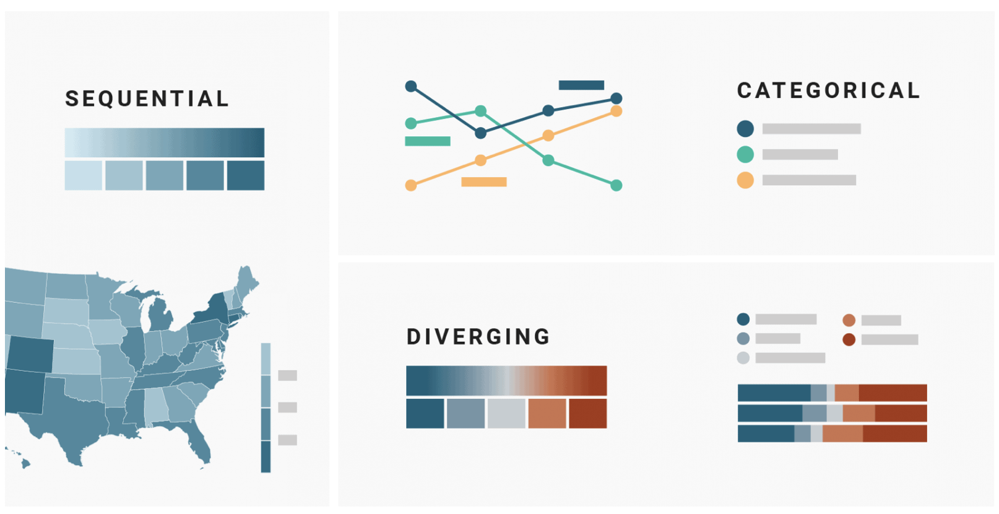
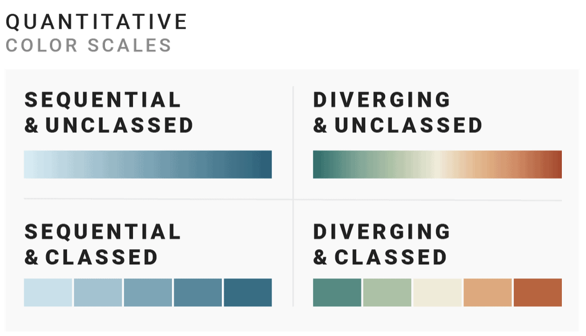
]
]

.pull-right[
Cada escala de color tiene una función asociada con su tipo de variable.<br><br>  

]

.footnote[
[Spectrum Adobe](https://spectrum.adobe.com/page/color-for-data-visualization/) <br>
[Which color scale to use when visualizing data - Lisa Charlotte Rost](https://blog.datawrapper.de/which-color-scale-to-use-in-data-vis/)]

---
## Escala de color según variable 
```{r diagram-label_1, echo=FALSE, message=FALSE, warning=FALSE, fig.dim=c(15, 6), fig.align='center'}
grViz("
digraph color {

  # a 'graph' statement
  graph [overlap = true, 
        fontsize = 18
        compound = true,
          layout = dot,
         rankdir = LR]

  # several 'node' statements
  node [shape = plaintext,
     fontsize = 18,
    fontcolor = 'black',
        color = '#D7D7D9']
     # Variables
     a [label = 'Variables']
     
  node [shape = plaintext,
     fontsize = 18,
    fontcolor = '#136585',
        color = '#73455E']
     b [label = 'Cualitativas']
     
  node [shape = plaintext,
     fontsize = 18,
    fontcolor = '#73455E',
        color = '#136585'] 
     c [label = 'Cuantitativas']
     
  node [shape = plaintext,
     fontsize = 18,
    fontcolor = '#136585',
        color = '#73455E']  
     # Categóricas
     d [label = 'Categóricas']
     e [label = 'Dicotómicas']
     f [label = 'Politómicas']
     g [label = 'Nominales']
     h [label = 'Ordinales']
     
  node [shape = plaintext,
     fontsize = 18,
    fontcolor = '#73455E',
        color = '#136585']   
     # Númericas  
     i [label = 'Numéricas']
     j [label = 'Continuas']
     k [label = 'Discretas']
     
    node [shape = plaintext,
      fixedsize = true,
          width = 2.5,
      fontcolor = '#136585',
          color = '#73455E']
    e2 [label = '2 Valores \nPosibles']
    e3 [label = 'Ej. Si-No, \nPositivo-Negativo']
    e4 [label = 'Paletas Divergentes']

    node [shape = plaintext,
      fixedsize = true,
          width = 2.5,
      fontcolor = '#136585',
          color = '#73455E']          
    g2 [label = 'No Ordenable']
    g3 [label = 'Ej. Jorge, Tomás,...']
    g4 [label = 'Paletas Categóricas']

    node [shape = plaintext,
      fixedsize = true,
          width = 2.5,
      fontcolor = '#136585',
          color = '#73455E']           
    h2 [label = 'Ordenable']
    h3 [label = 'Ej. Primero, \nSegundo,...']
    h4 [label = 'Paletas Sequenciales']

    node [shape = plaintext,
      fixedsize = true,
          width = 2.8,
      fontcolor = '#73455E',
          color = '#136585']         
    j2 [label = 'Ordenable']
    j3 [label = 'Ej. Peso \n(2,3 g, 2,4 g,...)']
    j4 [label = 'Paletas Sequenciales']

    node [shape = plaintext,
      fixedsize = true,
          width = 2.5,
      fontcolor = '#73455E',
          color = '#136585']         
    k2 [label = 'Ordenable']
    k3 [label = 'Ej. Hijos \n(1, 2, 3,...)'] 
    k4 [label = 'Paletas Sequenciales']
  
  edge [color = '#D7D7D9', 
    arrowhead = none, 
    arrowtail = none] 
  
  # several 'edge' statements
  a->b->d
  d->e->e2->e3->e4
  d->f
  f->g->g2->g3->g4
  f->h->h2->h3->h4

  a->c->i
  i->j->j2->j3->j4
  i->k->k2->k3->k4
  
}
")
```

.footnote[
[Spectrum Adobe](https://spectrum.adobe.com/page/color-for-data-visualization/) <br>
[Which color scale to use when visualizing data - Lisa Charlotte Rost](https://blog.datawrapper.de/which-color-scale-to-use-in-data-vis/)]

---
### Paletas de Color {RColorBrewer}

.pull-left[
**RColorBrewer** posee tres tipos de paletas de color:<br><br>

- **Paletas Sequenciales**: Adecuadas para datos ordenados que incrementan su magnitud.<br><br>
- **Paletas Categóricas**:  No implican magnitudes diferentes de los niveles del factor, y son solo usados para crear un diferencia visual entre los niveles del factor.<br><br>
- **Paletas Divergentes**: Adecuadas para datos dicotómicos, poniendo igual enfasís en los rangos bajos-medios (neutrales) y máximos a ambos extremos de los rangos.<br><br>

.footnote[[{RColorBrewer}](https://rdrr.io/cran/RColorBrewer/man/ColorBrewer.html)]
]

.pull-right[
```{r plot-label_17, echo=FALSE, fig.dim=c(9, 8), message=FALSE, warning=FALSE}
par(mar=c(2,2,2,2))
display.brewer.all()
```
]
---
### Paletas de Color {RColorBrewer} 
```{r plot-label_17b, echo=FALSE, message=FALSE, warning=FALSE, fig.dim=c(16, 7), fig.align='center'}
# Crear el gráfico
plot <- ggplot(data = diamonds, 
               mapping = aes(x = price, 
                     y = carat,
                 color = color)) + 
        geom_point()

# With themes
plot1 = plot + theme_classic() + annotate("text", x = 5000, y = 4, label = "Blues", col="#73455E",size=4) + scale_color_brewer(palette = "Blues")
plot2 = plot + theme_classic() + annotate("text", x = 5000, y = 4, label = "YlGn", col="#73455E",size=4) + scale_color_brewer(palette = "YlGn")
plot3 = plot + theme_classic() + annotate("text", x = 5000, y = 4, label = "Greens",col="#73455E",size=4) + scale_color_brewer(palette = "Greens")
plot4 = plot + theme_classic() + annotate("text", x = 5000, y = 4, label = "Greys",col="#73455E",size=4) + scale_color_brewer(palette = "Greys")
plot5 = plot + theme_classic() + annotate("text", x = 5000, y = 4, label = "Oranges",col="#73455E",size=4) + scale_color_brewer(palette = "Oranges")
plot6 = plot + theme_classic() + annotate("text", x = 5000, y = 4, label = "PuBuGn",col="#73455E",size=4) + scale_color_brewer(palette = "PuBuGn")
plot7 = plot + theme_classic() + annotate("text", x = 5000, y = 4, label = "RdPu" , col="#73455E",size=4) + scale_color_brewer(palette = "RdPu")
plot8 = plot + theme_classic() + annotate("text", x = 5000, y = 4, label = "YlGnBu",col="#73455E",size=4) + scale_color_brewer(palette = "YlGnBu")
 
 
# Arreglar y generar gráficos en cuadrícula 2x1 
grid.arrange(plot1,plot2,plot3,plot4,plot5,plot6,plot7,plot8, ncol=4)
```

---
### Paletas de Color {viridis}

.pull-left[
**viridis** posee paletas de color diseñadas para mejorar la interpretación de personas con distintas formas de daltonismo y/o deficiencia de la visión del color:<br><br>

- **Paletas Sequenciales**: Adecuadas para datos ordenados que incrementan su magnitud.<br><br>
 - Coloridas: Ocupan una amplia variedad de colores.<br><br>
 - Uniformes: Colores similares son asociados con valores similares.<br><br>
 - Robustas: Colores que permiten la interpretación de personas con formas comunes de daltonismo y/o deficiencia de la visión del color.<br><br>

.footnote[[{viridis}](https://cran.r-project.org/web/packages/viridis/vignettes/intro-to-viridis.html)]
]

.pull-right[
```{r plot-label_17c, echo=FALSE, fig.dim=c(9, 8), message=FALSE, warning=FALSE}
par(mar=c(1,1,1,1))
pals::pal.bands(viridis::magma, viridis::inferno, viridis::plasma, viridis::viridis, viridis::cividis, viridis::rocket, viridis::mako, viridis::turbo,
                labels = c("magma","inferno","plasma","viridis","cividis","rocket","mako","turbo"), 
                main = "viridis",
                gap = 0.1)
```
]

---
### Paletas de Color {viridis} 
```{r plot-label_17d, echo=FALSE, message=FALSE, warning=FALSE, fig.dim=c(16, 7), fig.align='center'}
# Crear el gráfico
plot <- ggplot(data = diamonds, 
               mapping = aes(x = price, 
                     y = carat,
                 color = color)) + 
        geom_point()

# With themes
plot1 = plot + theme_classic() + annotate("text", x = 5000, y = 4, label = "magma", col="#73455E",size=4) + scale_color_viridis(option = "A", discrete = TRUE)
plot2 = plot + theme_classic() + annotate("text", x = 5000, y = 4, label = "inferno", col="#73455E",size=4) + scale_color_viridis(option = "B", discrete = TRUE)
plot3 = plot + theme_classic() + annotate("text", x = 5000, y = 4, label = "plasma",col="#73455E",size=4) + scale_color_viridis(option = "C", discrete = TRUE)
plot4 = plot + theme_classic() + annotate("text", x = 5000, y = 4, label = "viridis",col="#73455E",size=4) + scale_color_viridis(option = "D", discrete = TRUE)
plot5 = plot + theme_classic() + annotate("text", x = 5000, y = 4, label = "cividis",col="#73455E",size=4) + scale_color_viridis(option = "E", discrete = TRUE)
plot6 = plot + theme_classic() + annotate("text", x = 5000, y = 4, label = "rocket",col="#73455E",size=4) + scale_color_viridis(option = "F", discrete = TRUE)
plot7 = plot + theme_classic() + annotate("text", x = 5000, y = 4, label = "mako" , col="#73455E",size=4) + scale_color_viridis(option = "G", discrete = TRUE)
plot8 = plot + theme_classic() + annotate("text", x = 5000, y = 4, label = "turbo",col="#73455E",size=4) + scale_color_viridis(option = "H", discrete = TRUE)
 
 
# Arreglar y generar gráficos en cuadrícula 2x1 
grid.arrange(plot1,plot2,plot3,plot4,plot5,plot6,plot7,plot8, ncol=4)
```

---
## paquetes-**RColorBrewer** & **viridis**
```{r eval=FALSE, include=TRUE}
# Instalar desde CRAN (The Comprehensive R Archive Network)
install.packages("RColorBrewer")
install.packages("viridis")
```

```{r eval=FALSE, include=TRUE}
# Cargar desde la librería
library(RColorBrewer)
library(viridis)
```

.bg-washed-green.b--dark-green.ba.bw2.br3.shadow-5.ph4.mt2[
Para mas información, puedes escribir `help("RColorBrewer")` o `help("viridis")` en tú consola de R.  
.tr[
— _Consejos_
]]

---
### ¿Cómo implementar paletas categóricas en mi gráfico?

Dependiendo del mapeo estético, se debe utilizar `scale_color_*()` o `scale_fill_*()`. <br>
```{r plot-label_17e, eval=FALSE, include=TRUE}
ggplot(data = diamonds, mapping = aes(x = price, y = carat, color = color)) + 
       geom_point() +
       scale_color_brewer(palette = "YlGnBu") 
     # scale_fill_brewer(palette = "YlGnBu")


ggplot(data = diamonds, mapping = aes(x = price, y = carat, color = color)) + 
       geom_point() + 
       scale_color_viridis(option = "magma", discrete = TRUE) 
     # scale_fill_viridis(option = "magma", discrete = TRUE)


## Agregar una escala de color manualmente
ggplot(data = diamonds, mapping = aes(x = price, y = carat, color = color)) + 
       geom_point() +
       scale_color_manual(values = c("#E69F00","#56B4E9","#009E73","#F0E442",
                                     "#0072B2","#D55E00","#CC79A7","#000000")) 
```

---
### ¿Cómo implementar paletas categóricas en mi gráfico?

```{r plot-label_17f, echo=FALSE, message=FALSE, warning=FALSE, fig.dim=c(16, 7), fig.align='center'}
# Crear el gráfico
plot <- ggplot(data = diamonds, mapping = aes(x = price, y = carat, color = color)) + geom_point() 

# With themes
plot1 = plot + theme_classic() + annotate("text", x = 5000, y = 4, label = "*_brewer", col="#73455E",size=4) + scale_color_brewer(palette = "YlGnBu")
plot2 = plot + theme_classic() + annotate("text", x = 5000, y = 4, label = "*_viridis" , col="#73455E",size=4) + scale_color_viridis(option = "magma", discrete = TRUE)
plot3 = plot + theme_classic() + annotate("text", x = 5000, y = 4, label = "*_manual" , col="#73455E",size=4) + scale_color_manual(values = c("#E69F00","#56B4E9","#009E73","#F0E442", "#0072B2","#D55E00","#CC79A7","#000000"))

# Arreglar y generar gráficos en cuadrícula 3x1 
grid.arrange(plot1,plot2,plot3, ncol=3)
```

---
### ¿Cómo implementar paletas sequenciales y/o divergentes en mi gráfico?

Dependiendo del mapeo estético, se debe utilizar `scale_color_*()` o `scale_fill_*()`. <br>
```{r plot-label_17g, eval=FALSE, include=TRUE}
ggplot(data = diamonds, mapping = aes(x = price, y = carat, color = depth)) + geom_point() +
       scale_colour_distiller(palette = "YlGnBu") 

ggplot(data = diamonds, mapping = aes(x = price, y = carat, color = depth)) + geom_point() + 
       scale_color_viridis(option = "magma", discrete = FALSE) 

## Agregar una paleta sequencial manualmente
ggplot(data = diamonds, mapping = aes(x = price, y = carat, color = depth)) + geom_point() +
       scale_color_gradient(low ="blue", high ="white") 

## Agregar una paleta sequencial clasificada manualmente
ggplot(data = diamonds, mapping = aes(x = price, y = carat, color = depth)) + geom_point() +
       scale_colour_steps(low ="blue", high ="white")

## Agregar una paleta divergente manualmente
ggplot(data = diamonds, mapping = aes(x = price, y = carat, color = depth)) + geom_point() +
       scale_color_gradient2(low ="red", mid = "white", high ="blue")

## Agregar una paleta divergente clasificada manualmente
ggplot(data = diamonds, mapping = aes(x = price, y = carat, color = depth)) + geom_point() +
       scale_colour_steps2(low ="red", mid = "white", high ="blue")
```

---
### ¿Cómo implementar paletas sequenciales y/o divergentes en mi gráfico?

```{r plot-label_17h, echo=FALSE, message=FALSE, warning=FALSE, fig.dim=c(16, 7), fig.align='center'}
# Crear el gráfico
plot <- ggplot(data = diamonds, mapping = aes(x = price, y = carat, color = depth)) + geom_point() 

# With themes
plot1 = plot + theme_classic() + annotate("text", x = 5000, y = 4, label = "*_distiller", col="#73455E",size=4) + scale_colour_distiller(palette = "YlGnBu")
plot2 = plot + theme_classic() + annotate("text", x = 5000, y = 4, label = "*_viridis", col="#73455E",size=4) + scale_color_viridis(option = "magma", discrete = FALSE)
plot3 = plot + theme_classic() + annotate("text", x = 5000, y = 4, label = "*_gradient",col="#73455E",size=4) + scale_color_gradient(low ="blue", high ="white") 
plot4 = plot + theme_classic() + annotate("text", x = 5000, y = 4, label = "*_steps",col="#73455E",size=4) + scale_colour_steps(low ="blue", high ="white")
plot5 = plot + theme_classic() + annotate("text", x = 5000, y = 4, label = "*_gradient2",col="#73455E",size=4) + scale_color_gradient2(low ="red", mid = "white", high ="blue")
plot6 = plot + theme_classic() + annotate("text", x = 5000, y = 4, label = "*_steps2",col="#73455E",size=4) + scale_colour_steps2(low ="red", mid = "white", high ="blue")

# Arreglar y generar gráficos en cuadrícula 2x1 
grid.arrange(plot1,plot2,plot3,plot4,plot5,plot6, ncol=3)
```

---
### Errores comunes del uso del color

.pull-left[
1. **Uso ineficiente del color para asignar niveles**. <br><br>
1. Asignar colores diferenciales a la misma variable. <br><br>
1. Uso de paletas de color no monotónicas. <br><br>
1. Uso de paletas de color no pensadas para deficiencías en la percepción de color. <br><br><br>
><small>Como recomendación núnca utilizar más de 8 colores (idealmente hasta 5) para mostrar categorías distintas.</small>
]

.pull-right[
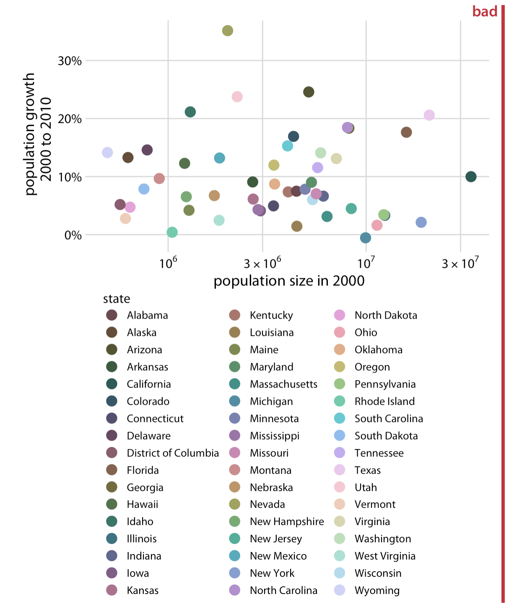
]

.footnote[[Fundamentals of Data Visualization - Claus Wilke - (Chapter 19) Common pitfalls of color use](https://clauswilke.com/dataviz/color-pitfalls.html)]

---
### Errores comunes del uso del color

.pull-left[
1. Uso ineficiente del color para asignar niveles. <br><br>
1. **Asignar colores diferenciales a la misma variable**. <br><br>
1. Uso de paletas de color no monotónicas. <br><br>
1. Uso de paletas de color no pensadas para deficiencías en la percepción de color. <br><br>
]

.pull-right[
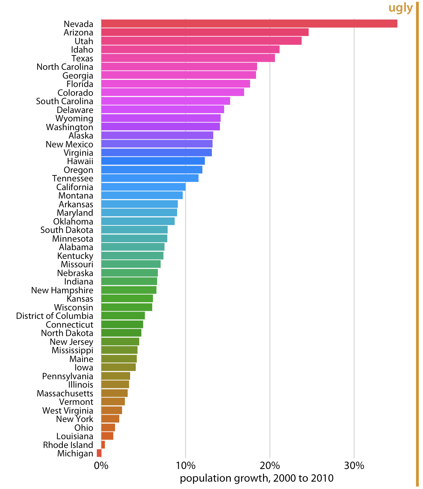
]

.footnote[[Fundamentals of Data Visualization - Claus Wilke - (Chapter 19) Common pitfalls of color use ](https://clauswilke.com/dataviz/color-pitfalls.html)]

---
### Errores comunes del uso del color

.pull-left[
1. Uso ineficiente del color para asignar niveles. <br><br>
1. Asignar colores diferenciales a la misma variable. <br><br>
1. **Uso de paletas de color no monotónicas**. <br><br>
1. Uso de paletas de color no pensadas para deficiencías en la percepción de color. <br><br>
]

.pull-right[
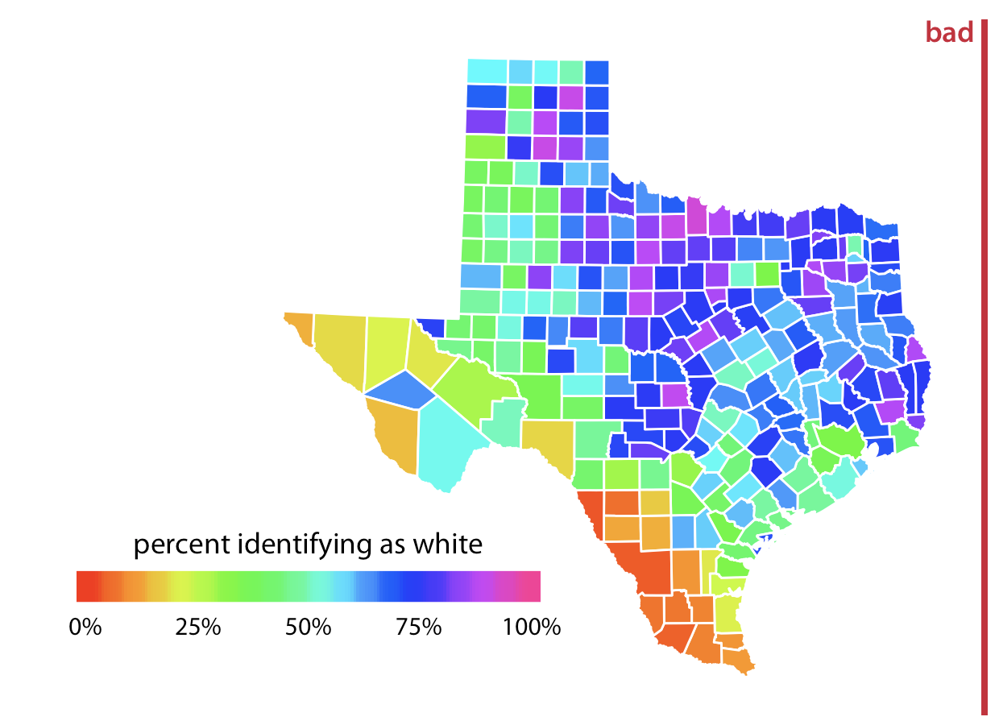
]

.footnote[[Fundamentals of Data Visualization - Claus Wilke - (Chapter 19) Common pitfalls of color use ](https://clauswilke.com/dataviz/color-pitfalls.html)]

---
### Errores comunes del uso del color

.pull-left[
1. Uso ineficiente del color para asignar niveles. <br><br>
1. Asignar colores diferenciales a la misma variable. <br><br>
1. Uso de paletas de color no monotónicas. <br><br>
1. **Uso de paletas de color no pensadas para deficiencías en la percepción de color**. <br><br>
]

.pull-right[
.center[
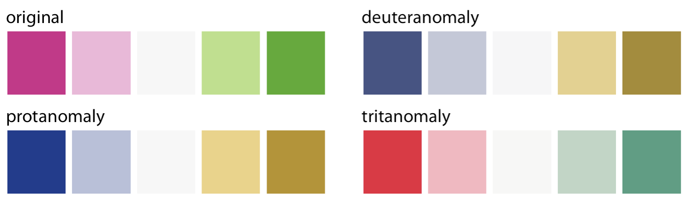
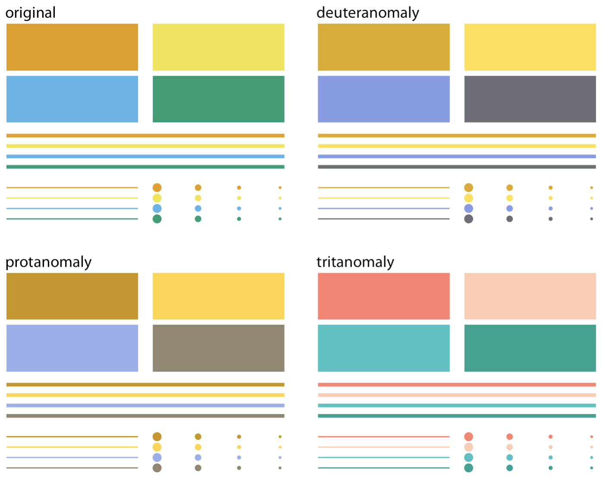
]
]

.footnote[[Fundamentals of Data Visualization - Claus Wilke - (Chapter 19) Common pitfalls of color use ](https://clauswilke.com/dataviz/color-pitfalls.html)]

---
### Sugerencias frente a errores comunes del uso del color

.pull-left[
Evitar las paletas tipo "Rainbow". Utilizar paletas con gradientes monotónicos.<br><br>

- **Paletas Sequenciales**: Adecuadas para datos ordenados que incrementan su magnitud.<br><br>
 - **viridis**<br><br>
 - **RColorBrewer**  (Paletas *seq*).<br><br>
 
- **Paletas Divergentes**: Adecuadas para datos dicotómicos
 - **RColorBrewer**  (Paletas *div*).<br><br>

]

.pull-right[
```{r plot-label_17i, echo=FALSE, fig.dim=c(9, 8), message=FALSE, warning=FALSE}
par(mar=c(1,1,1,1))
pals::pal.safe(rainbow,
               main = "Rainbow")
```
]

---
### Sugerencias frente a errores comunes del uso del color

.pull-left[
**Okabe and Ito (2008)** Paleta de color para escalas discretas diseñada para mejorar la interpretación de personas con daltonismo:<br>

| Color          | Código Hex |
|----------------|------------|
| orange         | #E69F00    |
| sky blue       | #56B4E9    |
| bluish green   | #009E73    |
| yellow         | #F0E442    |
| blue           | #0072B2    |
| vermilion      | #D55E00    |
| reddish purple | #CC79A7    |
| black          | #000000    |

.footnote[[Fundamentals of Data Visualization - Claus Wilke - (Chapter 19) Common pitfalls of color use ](https://clauswilke.com/dataviz/color-pitfalls.html) <br>
[Okabe and Ito (2008)](https://jfly.uni-koeln.de/color/)]
]

.pull-right[
.center[
```{r plot-label_17j, echo=FALSE, message=FALSE, warning=FALSE}
par(mar=c(1,1,1,1))
scales::show_col(c("#E69F00","#56B4E9","#009E73","#F0E442","#0072B2","#D55E00","#CC79A7","#000000"), ncol = 4, borders = NA)
```
]
]

---
.bg-washed-green.b--dark-green.ba.bw2.br3.shadow-5.ph4.mt4[
1. Intentar siempre ser consistente en el uso de color (no cambiar el color de las categorías entre un gráfico y otro).<br><br>
1. Evitar el uso de todo el espectro de color. Utilizar matices del mismo color es una buena estrategía.<br><br>

.tr[
— _Consejos_
]]

.center[
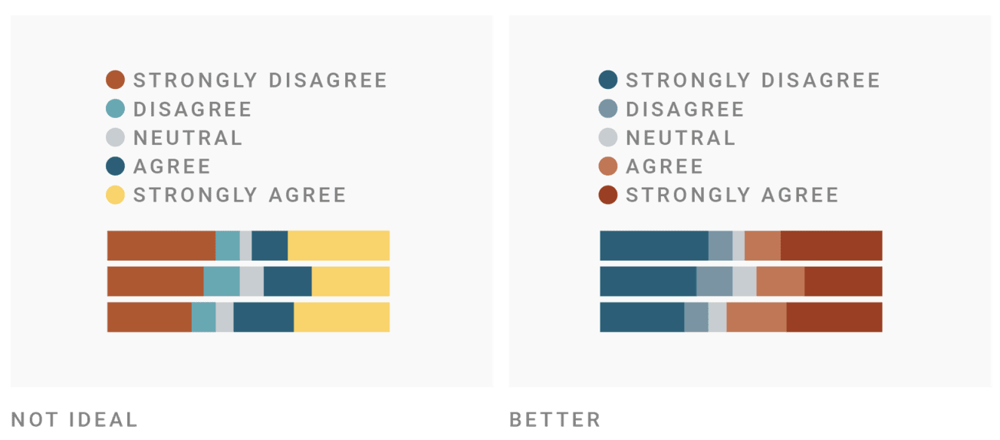
]

.footnote[[Quantitative vs qualitative color scales - Lisa Charlotte Rost](https://blog.datawrapper.de/quantitative-vs-qualitative-color-scales/)]

---
.bg-washed-red.b--dark-red.ba.bw2.br3.shadow-5.ph4.mt4[
No existe una combinación de color que sea efectiva en el 100% de los casos, comprobar las características de tú paleta de color es siempre necesario. El color del fondo, el tamaño del objeto coloreado, y/o el número de datos pueden influir en la percepción diferencial de los distintos niveles.<br>  
.tr[
— _Advertencia_
]]

.bg-washed-green.b--dark-green.ba.bw2.br3.shadow-5.ph4.mt4[
.center[
En el siguiente link pueden revisar si su paleta de color es adecuada (daltonismo y contraste).<br>
[Viz Palette - Susie Lu & Elijah Meeks](https://projects.susielu.com/viz-palette)<br>
]

.tr[
— _Consejos_
]]

---
### ¿Donde consultar otras paletas de color?

.center[
Buscar paletas de color <br><br><br> 
[EmilHvitfeldt/r-color-palettes](https://github.com/EmilHvitfeldt/r-color-palettes)<br><br>
[Abobe Color](https://color.adobe.com/create/color-wheel)<br><br>
[Color Scheme Designer](https://colorschemedesigner.com/csd-3.5/)<br><br>
[i want hue](https://medialab.github.io/iwanthue/)<br><br>
]

---
class: center, middle

# Muchas Gracias!!

Presentación creada en R con los paquetes:

[xaringan](https://github.com/yihui/xaringan)<br>
[xaringanthemer](https://github.com/gadenbuie/xaringanthemer)<br>
[R Markdown](https://rmarkdown.rstudio.com).<br>